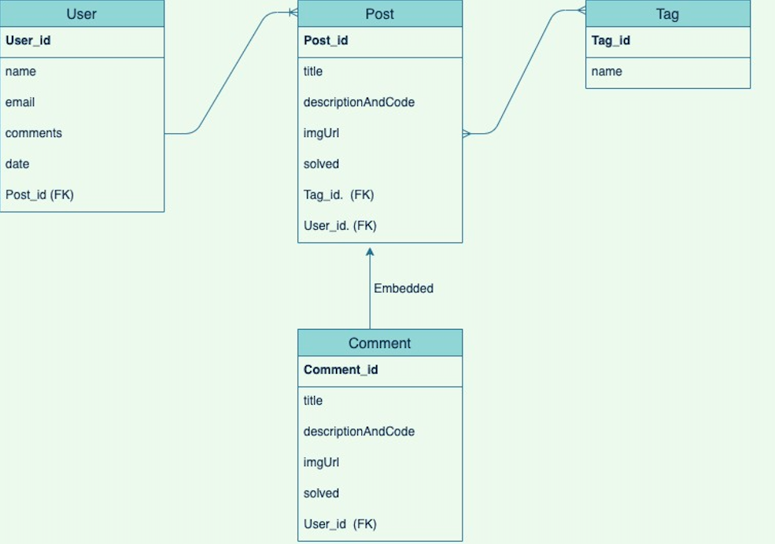

# Project 3 - exitcodeZERO (Backend) 

## Purpose

To save and send the data by setting up proper routes and database. 

## Techonologies Used

- node.js
- MongoDB : database 
- passport, bcrypt, jwt : authenticationn
- dotenv: hold jwt secret and server local host 
- express: routing

## Planning 
[Project 3 Pitch Repo](https://github.com/imjchiang/Project3Pitch)

Database ERD



## Installation

1. go to GIT REPOSITORY 
2. fork and clone the repository
3. install all node packages
    - npm install

    
4. set up the server
-  create server.js

server.js
``` Javascript
require("dotenv").config();
const express = require("express");
const app = express();
const cors = require("cors");
const port = process.env.PORT || 8000;
const passport = require("passport");

const users = require("./routes/api/users");
const posts = require("./routes/api/posts")
const tags = require("./routes/api/tags")

//MIDDLEWARE
app.use(cors());
app.use(express.urlencoded({extended: false}));
app.use(express.json());

//passport middleware
app.use(passport.initialize());
//importing passport file into server
require("./config/passport")(passport);


//ROUTES
app.get("/", (req, res) =>
{
    res.status(200).json({message: "Smile, you\'re being watched by the Backend Team"});
});

app.use("/api/users", users);
app.use("/api/posts", posts);
app.use("/api/tags", tags);

app.listen(port, () =>
{
    console.log(`Server is running on port: ${port}`);
});
```
5. Set up the database 
- create index.js file in the models folder

./models/index.js
``` JSON
require("dotenv").config();
const mongoose = require("mongoose");
const MONGO_URI = process.env.MONGO_URI

//Mongo connection
mongoose.connect(MONGO_URI, 
{
    useNewUrlParser: true,
    useUnifiedTopology: true,
    useFindAndModify: false
});

//mongoose connection object
const db = mongoose.connection;

//set up an event listener to fire once when the connections "opens"
//console log what hose and port it's running on

db.once("open", () =>
{
    console.log(`Connected to MongoDB at ${db.host}:${db.port}`);
});

db.on("error", (err) =>
{
    console.log(`Database error \n ${err}`);
});


```
5. add a .env file with the following field: <br>
JWT_SECRET<br>
MONGO_URI with your local host url 

6. run the server!
- nodemon
- node server.js

<br>

## Models (Schema)

- Post
- Tag
- User 
- Comment (nested)
<br>

### How to create Schemas
#### 1. Creat Post.js, Tags.js, User.js in models folder. 


./models/Post.js
 ``` Javascript
const mongoose = require("mongoose");
const Schema = mongoose.Schema;

//Comment Schema
const CommentSchema = new Schema(
{
    //an array of text
    descriptionsAndCode:
    [{
        type: String,
        default: "No description or code available"
    }],
    //url for image of code snippets
    imgUrl:
    [{
        type: String,
        default: undefined
    }],
    //User passed by the reference to id
    author:
    {
        type: Schema.ObjectId,
        ref: "User"
    },
    //an array of Users passed by the reference to id
    upvote:
    [{
        type: Schema.ObjectId,
        ref: "User"
    }],
    //an array of Users passed by the reference to id
    downvote:
    [{
        type: Schema.ObjectId,
        ref: "User"
    }],
    //default false, can be changed to true if Post author indicates
    starredOnPost: 
    {
        type: Boolean,
        default: false
    },
    date:
    {
        type: Date,
        default: Date.now()
    }
});

module.exports = Comment = mongoose.model("Comment", CommentSchema);


//User Schema
const PostSchema = new Schema(
{
    title:
    {
        type: String,
        required: true
    },
    //an array of tags passed by the reference to id
    tags:
    [{
        type: Schema.ObjectId,
        ref: "Tag"
    }],
    //an array of text
    descriptionAndCode:
    [{
        type: String,
        default: "No description or code available"
    }],
    imgUrl:
    [{
        type: String,
    }],
    //User passed by the reference to id
    author:
    {
        type: Schema.ObjectId,
        ref: "User"
    },
    //an array of Users passed by the reference to id
    upvote:
    [{
        type: Schema.ObjectId,
        ref: "User"
    }],
    //an array of Users passed by the reference to id
    downvote:
    [{
        type: Schema.ObjectId,
        ref: "User"
    }],
    //default false, can be changed to true if Post author indicates
    solved: 
    {
        type: Boolean,
        default: false
    },
    //an array of comments embedded to the Post
    comments: [CommentSchema],
    date:
    {
        type: Date,
        default: Date.now()
    }
});

module.exports = Post = mongoose.model("Post", PostSchema);
```

Post Schema has two types of relational schemas.  
- Embedded relationship : Comment Schema 
- Referenced realatipnship : User Schema, Tag Schema

####  2. Export the schemas in the index.js 

 ./models/index.js
 ``` javascript
module.exports.User = require("./User");
module.exports.Post = require("./Post");
module.exports.Tag = require("./Tag");
```
- Embedded Schema doesn't need to be exported. 


## Rundown Progress
- ### 9.4.2020 - complete main auth (led by @RomeBell)
    - skeleton setup
    - validation for password
    - user creation validation
    - passport implementation

- ### 9.5.2020 
    - set up server
    - set up database and models 

- ### 9.6.2020
    - set up routers
    - add CRUD routes for post
    
- ### 9.7.2020
    - revise tag schema
    - insert tag data to get the reference id 
    - add get route for tag
    - BLOCKER 1:
    - getting User name(user schema) from Post schema
    - complete BLOCKER 1: add .populate with the path

- ### 9.8.2020
    - add CRUD routes for comment
    - BLOCKER 2:
    - calling the specific comments in the nested schema to edit
    - complete Blocker 2: use both user id and comments id 

- ### 9.9.2020
    - add imgUrl in post schema 

- ### 9.10.2020
    - add imgUrl in comment schema 
    - revise comment routes 


## Code Snippet Examples 
There were different routes for each models, and these are the examples. 


#### GET ROUTE

``` javascript


router.get('/', (req,res) => {
    //console.log(req.query.filter)
    if(req.query.filter){
        let f = req.query.filter.split(',')
        console.log(f)
        db.Post.find({'tags':{$in:f}}).populate({path:'author',select:'name'}).sort('-date')
        .then(foundPost => {
            // console.log(foundPost)
            res.send(foundPost)
        })
        .catch(err=>{
            console.log(err)
            res.status.apply(503).send({message: 'Database asleep?'})
        })

    } else {

        db.Post.find().populate({path:'author',select:'name'}).populate({path:"comments.author", select:"name"}).sort('-date')
        .then(foundPost => {
            // console.log(foundPost)
            res.send(foundPost)
        })
        .catch(err=>{
            console.log(err)
            res.status.apply(503).send({message: 'Database asleep?'})
        })
    }
})
```

- #### PURPOSE: gets all the posts data
-  {'tags':{$in:f}}) to find the posts with certain tags that users clicked on.
- .populate to get the author name from referenced User schema
- .sort('-date') to render the newest data on top of the page.

#### POST ROUTE

``` javascript
router.post("/", (req,res) => 
{   
    db.Post.create(req.body)
    .then(createdPost => {
        // console.log(createdPost)
        res.status(201).send(createdPost)
    })
    .catch(err => {
        console.log('Error while creating new post', err)
        if(err.name === 'Valication Error'){
            res.status(406).send({message: 'Validation Error'})
        } else {
            res.status(503).send({message: "Database or server error!"})
        }
    })
})

```
- #### PURPOSE: creates new post
    


#### PUT ROUTE
``` javascript

router.put('/:id/comments/edit', (req,res)=>
{
   
    db.Post.findOneAndUpdate(
    {
        _id: req.params.id,
        comments:{$elemMatch:{_id:req.body.referencedComment}}
    }, 
    {
        $set: 
        { 
            "comments.$.descriptionsAndCode": req.body.descriptionsAndCode,
            "comments.$.imgUrl": req.body.imgUrl
        }
    })
    .then(editedComment => {
        res.send(editedComment)
        console.log(editedComment)
    })
    .catch(err => {
        console.log(err)
        res.status(503).send({message: 'server error'})
    })
    
})

```
- #### PURPOSE: edits comments nested in the post. 
    - post id and comments id both are used to find the right comments
    - use $set to edit the data in the comments schema 


#### PUT ROUTE
``` javascript

router.put('/:id/comments/delete', (req,res)=>
{
    db.Post.findOneAndUpdate({
        _id:req.params.id
    }, 
    {$pull:
        {
            comments: {
                _id: req.body.id
            }
        }
    },   
    {
        new: true
    })
    .then(deletedcomment => {
        res.send(deletedcomment)
        console.log(deletedcomment)
    })
    .catch(err => {
        console.log(err)
        res.status(503).send({message: 'server error'})
    })
})
```
- #### PURPOSE: deletes comment
    - uses put route to delete the nested data
    - $pull to remove the comments out of the post data
    - adding comments also uses put route


